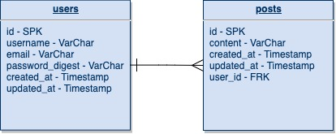

  SOFTWARE ENGINEERING IMMERSIVE

# Intro to Relational Data Modeling

## Objectives

- Draw entity relationship diagrams with crow's foot notation for ideas for web apps
- Describe how tables relate to each other using foreign keys
- Explain the different relationship types

## Preparation

- Understand the relationship between tables, rows and columns
- Describe how objects have attributes and functionality associated with them

## Review: What is a Relational Database

A database is a place where information gets stored in a hard drive - or distributed across multiple hard drives - on a computer somewhere. Much like we've been creating and storing data, here and there, a database represents a collection of individual pieces of data stored in a highly structured and searchable way; they represent a model of reality, which is why we call them models in MVC.

Inside a database, we do basic actions like create, read, update, and destroy data – hey look, CRUD!

In modern web development, we think of databases in two categories: relational databases and NoSQL databases. We will focus on relational databases in this course. Relational databases impose more restrictions on how we model our data but these restrictions have payoffs in speed of access and integrity of data at scale. Our primary hurdle in structuring our relational databases is describing the relations between different tables.

When describing data with JavaScript objects, we can "nest" resources (e.g. A `class` object could have properties `instructor` and `students`, instructor being an object that describes the instructor and `students` being an array of objects representing students). NoSQL databases let us structure our data in this way so it's closer to an intuition we may already have, but we need to make many more considerations about how we are going to access our data when deciding its appropriate structure.

Relational databases impose some restrictions where we do not (though PostgreSQL does permit it) nest data. Instead we associate records using `primary` and `foreign` keys. This can be approach can feel counter intuitive at first but will become more natural with practice.

## Entity Relationship Diagrams (ERDs)

Let's first take a look at an example of a "one-to-many" relation in an ERD:

*<small>ERD made with [draw.io](http://draw.io)</small>*

If we take a took here, this ERD is saying that one user has many posts (marked with the three line fork or "crow's feet"). Also we could say a single post only belongs to a single user (marked with the perpendicular line). To help visualize how to mark the ERD, we can take one item from a table and ask our selves "what is this items relationship to resources from the other table".  

Now let's consider a more complicated Entity Relationship Diagram (ERD) for a school (especially consider the relationships between `class`, `student`, and `instructor`)

> 

Relationships happen when we start seeing multiple duplicative information or when one object needs to "connect" to another object.

There are 3 different kinds:

### One to One

- not frequently used
- A student `has_one` SSN, and a SSN `belongs_to` a specific student - that lets us look up solely by SSN, and see the connected student
- Often, in situations like that, you can make the SSN an attribute of the student, but when the associated resource has, for example, multiple fields (e.g. an address), it might make sense to create another table for addresses and set up a `has_one` relationship

### One to Many

- the most common type of database relationship
- an university `has_many` classes, but a classes `belongs_to` only one university

### Many to Many

- also very frequent
- a student probably `has_many` classes, and a class also probably `has_many` students

Keep in mind, the `belongs_to` part always goes on the opposite side of the `has_many` or `has_one`. And the way it's stored is that the ID of the model that "has" something is stored in a field on the child, like "university_id".  In our example with university and classes, the class model `belongs_to` the university model, while the university `has_many` classes.

### Social Media Platform ERD (You Do)

Working with a partner and working on [draw.io](http://draw.io), draw the ERD for a social media platform

- MVP: Posts, Comments, Users
- Bronze: Favorites/Likes
- Silver: Friends
- Gold: Sub-comments

## Conclusion (5 mins)

- How do you represent a relational database in drawings? How would you describe the metaphor of storing data like a spreadsheet?
- What are the three types of relationships we have discussed today, and what are some examples of how you would you use them?
